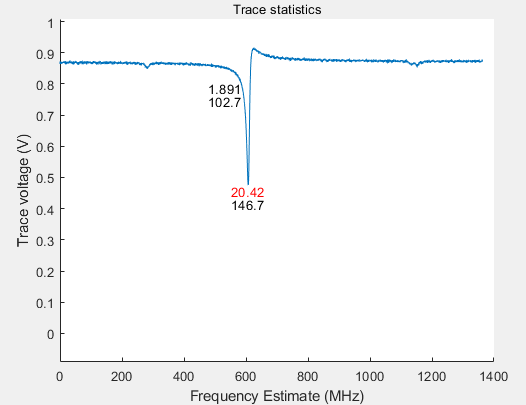

# Q Measurement
---
Update Notes on 09/01/2024

I just add another oscilloscope model but using a TCPIP to connect to it. The oscilloscope is Rohde&Schwarz RTA4004. Its connection does not follow the tutorial below. Instead, it is connected using its IP address and the oscilloscope must be setted to Interface -- Ethernet to get it work. The communication is done by SCPI command, which you find a detaled connection tutorial from its manual. 

Its IP address is 

169.254.218.202       

Once you have plugged the LAN cable to the computer, simply typing its IP address in the Internet Browser will allow you to see its spec.

---
This code contains two files: 

    1. Cao.m: This file defines the method to fit the data and do the fitting
    
    2. Q_Measurement.mlapp: This file defines the UI interface, will call Cao.m to do computation, and it is responsible for the connection to the oscilloscope to acquire data for fitting.
---
To use it, simply double click the Q_Measurement.mlapp, and make sure **Cao.m and Q_Measurement.mlapp are under the same folder!!!**

---
I am using DSOX1204G oscilloscope. If you are using a different type of oscilloscope, you must adapt the code in Q_Measurement.mlapp, to make sure that you can provide two arrays: 
1. array for mzi
2. array for trans

---
Due to the chaotic nature of different oscilloscope vendors. I have to adapt my code according to different oscilloscopes. 
 
DSOX_1204_G (in UCSB)
DSOX_2012_A (in Caltech)
Tektronix_MSO_3034 (in Caltech)
MSOS_254_A (in Caltech)

These four are guranteed to work and if you are also using these models, the only argument you need to change is the USB address for your oscilloscope. This could be found by in matlab: 

    resources(oscilloscope())

it should return you something like this: 

    USB0::0x0957::0x1799::MY52011887::0::INSTR','AgInfiniiVision

---
Updated on 2024/8/6
The MSOS_254_A_fano_V2 can return the parameters of fanoresonance when selected and it will also save a txt file additionally to record the exact fitting parameters. Files in this folder, though looks the same as files in the other folders, are actually different and cannot be used interchangeably.

---
In general, as long as you have downloaded all of the packages, one should be able to connect the oscilloscope using the default package as long as it is listed below: 

'Driver: tektronix
     Supported Models:
        TDS200, TDS1000, TDS2000, TDS1000B, TDS2000B, TPS2000
        TDS3000, TDS3000B, MSO4000, DPO4000, DPO7000, DPO70000B
     
     Driver: AgInfiniiVision
     Supported Models:
        DSO-X 2002A,DSO-X 2004A,DSO-X 2012A,DSO-X 2014A,DSO-X 2022A
        DSO-X 2024A,MSO-X 2002A,MSO-X 2004A,MSO-X 2012A,MSO-X 2014A
        MSO-X 2022A,MSO-X 2024A,DSO-X 3014A,DSO-X 3024A,DSO-X 3032A
        DSO-X 3034A,DSO-X 3052A,DSO-X 3054A,MSO-X 3012A,MSO-X 3014A
        MSO-X 3024A,MSO-X 3032A,MSO-X 3034A,MSO-X 3052A,MSO-X 3054A
        DSO-X 3012A,MSO-X 3102A,MSO-X 3104A,DSO-X 3102A,DSO-X 3104A
        DSO-X 3012T,DSO-X 3014T,DSO-X 3022T,DSO-X 3024T,DSO-X 3032T
        DSO-X 3034T,DSO-X 3054T,DSO-X 3102T,DSO-X 3104T,MSO-X 3012T
        MSO-X 3014T,MSO-X 3022T,MSO-X 3024T,MSO-X 3032T,MSO-X 3034T
        MSO-X 3052T,MSO-X 3054T,MSO-X 3102T,MSO-X 3104T,DSO-X 3052T
        MSO-X 3032G,MSO-X 3022G,DSO-X 3012G,DSO-X 3022G,DSO-X 3024G
        DSO-X 3014G,DSO-X 3032G,DSO-X 3034G,DSO-X 3052G,DSO-X 3054G
        DSO-X 3102G,DSO-X 3104G,MSO-X 3012G,MSO-X 3014G,MSO-X 3024G
        MSO-X 3034G,MSO-X 3052G,MSO-X 3054G,MSO-X 3102G,MSO-X 3104G
        DSO-X 4022A,DSO-X 4032A,DSO-X 4052A,DSO-X 4024A,DSO-X 4034A
        DSO-X 4054A,DSO-X 4154A,MSO-X 4022A,MSO-X 4032A,MSO-X 4052A
        MSO-X 4054A,MSO-X 4024A,MSO-X 4034A,MSO-X 4104A,MSO-X 4154A
        DSO-X 4104A,MSO-X 6002A,MSO-X 6004A,DSO-X 6002A,DSO-X 6004A
        M9241A,M9242A,M9243A,EDU-X 1002A,EDU-X 1002G,DSO-X 1102A
        DSO-X 1102G,DSOX1204A,DSOX1204G,DSOX1202G,DSOX1202A
        EDUX1052A,EDUX1052G,P9241A,P9242A,P9243A,C7312,C7312C,C7314
        C7314C,C7322,C7322C,C7324,C7324C,C7332,C7332C,C7334,C7334C

---

The prerequiste to run all of them, regardless of the models: 

    Curve Fitting Toolbox 23.2
    
    Instrument Control Toolbox 23.3
    
    Instrument Control Toolbox Support Package for Keysight IO Libraries and VISA Interface

    Instrument Control Toolbox Support Package for National Instruments VISA and ICP Interfaces

    Signal Processing Toolbox

These are the necessary packages to run everything properly. 

---

Above is the UI interface. I will explain how to use it step by step. 

## Step 0: Specify output folder
You need to enter a main address, which is the long horizontal line above. Sub1 and Sub2 are up user define. Overall, they will create: **\Main Path\sub1\sub2**

where sub1 and sub2 are two folders. 

If you leave them blank, then it would skip it. e.g. sub1 = blank, sub2 =A

**\Main Path\A**

You could also leave all of them blank, but you must enter a path for the main path. 

The data of the measurement will be automatically saved as: 

1. A single plot containing the Lorentzian fit and Q value for the highest Q at **\Main Path\A**. the plot name will dynamically change according to the MZI freq, and the Q measured.
2. One plot with Q for all peaks detected and one plot with Q-statistics at **\Main Path\A\B**
3. Regardless of your choice of A and B, a folder called "data_mzi" containing all of the raw oscilloscope data and numerical fitting result in .matlabdata form will be created at **\Main Path\A\B\data_mzi**

## Step 1: Choose the Channel

For the quality of Q measurement, please always use **CH2 for transmission(Trans)**, **CH3 for MZI**, and disable other channels! Because for DSOX1204G: 

**"Half-channel operation on a 4-channel model refers to two-channel operation when using channel-1 or channel-2 AND channel-3 or channel-4. Example: If viewing just channel-1 and channel-3, maximum sample rate is 2 GSa/s and maximum memory is 2 M points. But if viewing channel-1 and channel-2, maximum sample rate is 1 GSa/s and maximum memory is 1 M points."**

## Step 1.5: FFT

This is optional. You could use it to filter your data if your oscilloscope is too garbage or the measured signal is too garbage. 

## Step 2: Enter the FSR of your MZI

As the name suggested, enter the FSR of your MZI

## Step 3: Enter the wavelength of your laser

## Step 4: Threshold

This is used to filtered some peaks. Peaks does not meet the threshold value will not be considered for fitting. 0.95 means that if the transmission of the peak is less than (1-0.95) then it will be discarded for fitting. 

To include more shallower peak, increae the threshold from 0.95 to 0.98 would greatly increase the number of peak considered. 

## Step 5 Correction Type 

### No Correction: 
As the name suggested, no correction would apply. This is not recommended. 

### Fano Resonance: FANO or FANOMZI
This type of resonance is the result of two coupled oscillators. For a detailed math, I recommend this paper: 

    Fano resonances in a multimode waveguide coupled to a high-Q silicon nitride ring resonator Dapeng Ding, Michiel J. A. de Dood, Jared F. Bauters, Martijn J. R. Heck, John E. Bowers, and Dirk Bouwmeester 
    https://opg.optica.org/oe/fulltext.cfm?uri=oe-22-6-6778&id=281922  

For an understanding at a storyteller level, I recommend my story. 

In the common Lorentzian case, we can think of it as a single oscillator and your driving frequency matches the oscillator's natural frequency, which will result in a Lorentzian dip. This dip is symmetric around the resonance. 

In the fano resonance case, we can think of it as two coupled driven harmonic oscillators and your pump laser is the driving field.

Above is the plot of x1(w), a diagram of the setting for the coupled oscillators, and a system of differential equations solving this classical problem. For a 2 by 2 matrix, there are two eigenmodes, shown as two peaks on the plot of x1(t). The shaded green peak is anti-symmetric around the resonance. We call this shape fano resonance. 

On the oscilloscope, I have experimentally observed this shape(If you see this shape, please use FANO or FANOMZI. I recommend FANOMZI.):

In the context of a ring resonator, there is a tapered fiber delivering energy, and a ring resonator receives and sends back the energy. Light, when confined in a tapered fiber, could have many eigenmodes, and this is a continuous basis. Light, when confined in a ring resonator, could have many discrete eigenmodes, and this is a discrete basis. These two types of vector spaces or the modes that exists in these two types of vector space could interfere with each other and result in the fano resonance shape, whose resonance mathematical structure is similar to a classical system of driven harmonic resonators.

** Below is my fantasy and this might be incorrect **

Fano resonance can be understood as a finite representations coupled to an infinite representations. In the finite representation of the Lorentz group, it is always attached to space-time, which is considered as an infinite vector space. When there is a spacetime transformation \( \Lambda \) on space time, it would modify the field\( \Phi \) in two ways: 1. The field itself \( \Phi \) by \(  U(\Lambda) \) 2. The space time by \( \Lambda x \). 

## Mode Splitting
Mode splitting results from the interference of clockwise and counter clockerwise interference of the light in the ring resonator. The back scattering will cause the light to reflect its direction inside the ring resonator, which could result in an opposite light propagate in the ring. When there is defect in the ring, this will result in back scattering and result in the mode splitting. 

A picture of mode splitting(theoretical plot) is below: 

## Cutoff frequency 
is the cutoff frequency used in 'osc' and  'oscmzi'. Sine components with less than cutoff_freq periods will be  removed. If not specified the code attempts to find a frequency by  analyzing the Q trace.
